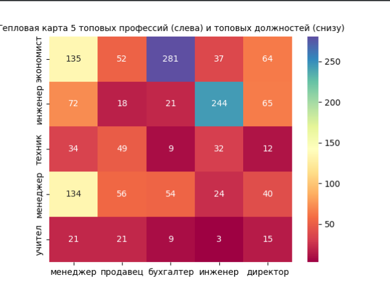

### Этап 1: работа с pandas

Задания выполнены в файле tasks.py.

### Этап 2: получение списка мест работы

Для выполнения задач необходимо каждому респонденту из выборки присвоить категории для определения
того, кем работает респондент. Далее категории будут именоваться тегами. Для того чтобы разбиение на теги было возможно,
необходимо составить список использующихся тегов.

Список необходимых тегов создается в popular_works.py. С помощью nltk проанализированы текстовую информацию
о профессии и последней должности каждого человека.

Для того, чтобы была возможность ручной доработки базы тегов, было выбрано только топ-100 самых используемых тегов.
Список этих тегов представлен в popular_works.csv.

### Итоги

Аналитика выполнена в файле big_task.py.

В выборку включались резюме, в которых поля qualification и jobTitle не были NaN и имели в тексте одно или более слово,
сводящееся к тэгу. По тегам строилась матрица 100x100, столбцы которой обозначали профессии, а строки - должности
респондентов. В ячейках матрицы находятся числа, являющиеся числом респондентов, сочетающих в себе оба тега отношением
которых и является ячейка.

Результат работы big_task.py:

Изначальная выборка без NaN состоит из 10130 пунктов.
После отбора значений, подходящих под составленный топ профессий в выборке осталось 4813 резюме, то есть 48%.
Не работают по профессии 75% респондентов.
Менеджерами чаще всего становятся люди с образованием:
    1) экономист (пунктов - 135);
    2) менеджер (пунктов - 134);
    3) инженер (пунктов - 72);
    4) юрист (пунктов - 42);
    5) техник (пунктов - 34);

Люди с образованием инженера чаще всего становятся:
    1) инженер (пунктов - 244);
    2) менеджер (пунктов - 72);
    3) директор (пунктов - 65);
    4) механик (пунктов - 27);

Тепловая карта:

